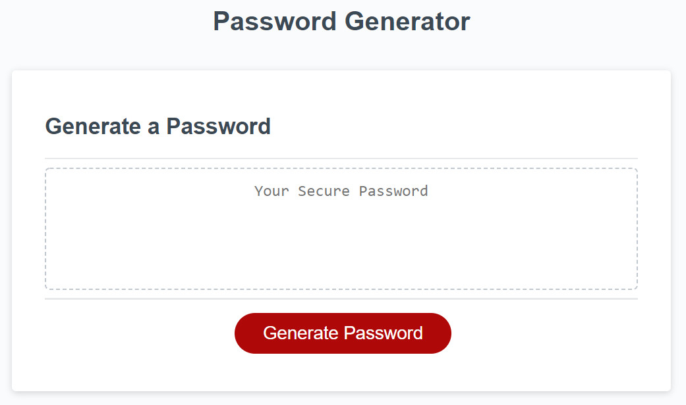

# Password Generator 

**Password Generator** - an application that an employee can use to generate a random password based on criteria,  a strong password that provides greater security. Responsive application adapting to multiple screen sizes.

## Installation

Website can be accessed at [elogonme.github.io/password-generator/](https://elogonme.github.io/password-generator/)

## Usage 
Click generate password button.
Answer questions to select password criteria. 
Password is generated matching the selected criteria.

## Repository
All the `code` is available at repository [github.com/elogonme/password-generator](https://github.com/elogonme/password-generator)
## Credits

Coded by Eldar Humbatov [github.com/elogonme](https://github.com/elogonme)

## License

This source code is available to everyone under the standard 
